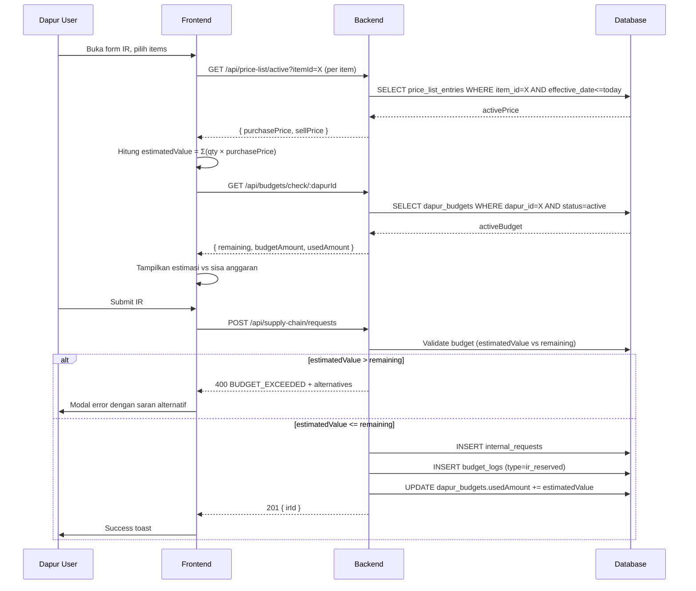
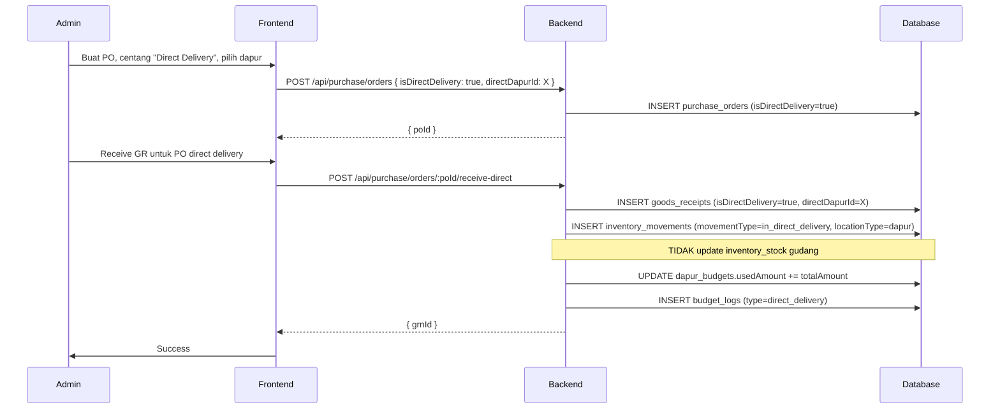

# Design Document: Price List & Budget Control

## Overview

Fitur **Price List & Budget Control** mengintegrasikan manajemen harga bahan baku dengan kontrol anggaran dapur dalam sistem ERP MBG. Fitur ini dibangun di atas stack yang sudah ada (Hono + Drizzle ORM + Turso/SQLite untuk backend, React + Vite + TanStack Query untuk frontend) dan memperluas modul yang sudah ada: BOM/Resep, PO, IR, dan Anggaran Dapur.

### Tujuan Utama

1. **Price List Management** — Daftar harga baku per item dengan effective date, mendukung import massal via Excel, dan resolusi harga otomatis pada transaksi.
2. **Budget Control** — Pagu anggaran harian/periodik per dapur, pemblokiran IR/PO yang melebihi anggaran, dan budget log untuk audit trail.
3. **Direct Delivery** — Pengiriman barang dari vendor langsung ke dapur tanpa melalui gudang utama, dengan pencatatan movement yang tepat.
4. **Vendor Invoice** — Akumulasi transaksi GR per vendor menjadi satu invoice, dengan tracking outstanding dan fitur cetak PDF.
5. **Simplifikasi Stok** — Menghilangkan monitoring stok dapur; hanya gudang utama yang dimonitor.

### Keputusan Arsitektur Kritis

- **Harga aktif** diresolvasi dengan query: `MAX(effectiveDate) WHERE effectiveDate <= queryDate AND itemId = ?`. Tidak ada konsep "expiry" — harga berlaku sampai ada harga baru.
- **Budget validation** dilakukan di backend saat IR dibuat, bukan di frontend, untuk mencegah race condition.
- **Direct delivery GR** tidak mengubah stok gudang sama sekali — movement dicatat sebagai `in_direct_delivery` langsung ke dapur.
- **Vendor Invoice** menggunakan GR ID sebagai foreign key untuk mencegah double billing.
- **Stok dapur** dihapus dari `inventory_stock` — tabel tetap ada tapi hanya `locationType = 'gudang'` yang digunakan.

---

## Architecture

### System Context

```
┌─────────────────────────────────────────────────────────────────┐
│                        Frontend (React + Vite)                   │
│                                                                   │
│  PriceListPage  BudgetLogPage  VendorInvoicePage                 │
│  RecipesPage*   PurchaseOrderPage*  InternalRequestPage*         │
│  BudgetPage*    StockPage*                                        │
└──────────────────────────┬──────────────────────────────────────┘
                           │ TanStack Query (REST)
┌──────────────────────────▼──────────────────────────────────────┐
│                        Backend (Hono)                             │
│                                                                   │
│  /api/price-list      Price_List_Manager                         │
│  /api/budget-logs     Budget_Controller                          │
│  /api/vendor-invoices Vendor_Billing                             │
│  /api/purchase/*      PO_Processor (modified)                    │
│  /api/supply-chain/*  IR_Processor (modified)                    │
└──────────────────────────┬──────────────────────────────────────┘
                           │ Drizzle ORM
┌──────────────────────────▼──────────────────────────────────────┐
│                     Turso (SQLite via libsql)                     │
│                                                                   │
│  price_list_entries   budget_logs                                │
│  vendor_invoices      vendor_invoice_items                       │
│  purchase_orders*     po_items*   dapur_budgets*                 │
│  goods_receipts*      inventory_stock* (gudang only)             │
└─────────────────────────────────────────────────────────────────┘
```

*) Tabel yang dimodifikasi

### Alur Data Utama

#### 1. Resolusi Harga Aktif

```
Request (itemId, queryDate)
    │
    ▼
SELECT * FROM price_list_entries
WHERE item_id = ? AND effective_date <= ?
ORDER BY effective_date DESC
LIMIT 1
    │
    ├─ Found → return { purchasePrice, sellPrice, effectiveDate }
    └─ Not Found → return null (caller handles "no price" state)
```

#### 2. Alur Pembuatan IR dengan Budget Validation

```
POST /api/supply-chain/requests
    │
    ▼
1. Hitung estimatedValue = Σ(qty × activePrice) per item
    │
    ▼
2. GET active budget for dapurId (status=active, periodStart<=now<=periodEnd)
    │
    ├─ No budget → WARNING (allow IR, no budget log)
    │
    └─ Budget found →
        │
        ├─ estimatedValue > remaining → REJECT (400)
        │   └─ Return: { error, remaining, estimated, deficit, alternatives }
        │
        └─ estimatedValue <= remaining → ALLOW
            └─ INSERT budget_log (type='ir_reserved', amount=estimatedValue)
            └─ UPDATE dapur_budgets.usedAmount += estimatedValue
```

#### 3. Alur Direct Delivery (PO → GR langsung ke Dapur)

```
PO (isDirectDelivery=true, directDapurId=X)
    │
    ▼
POST /api/purchase/orders/:poId/receive-direct
    │
    ▼
1. Validate PO has isDirectDelivery=true
2. INSERT goods_receipts (isDirectDelivery=true, dapurId=X)
3. INSERT gr_items
4. INSERT inventory_movements (movementType='in_direct_delivery', locationType='dapur', dapurId=X)
   ← TIDAK update inventory_stock (stok gudang tidak berubah)
5. UPDATE dapur_budgets.usedAmount += totalAmount (budget dapur dipotong)
6. INSERT budget_log (type='direct_delivery', refType='grn', refId=grnId)
7. Mark GR as eligible for vendor invoice accumulation
```

#### 4. Alur Vendor Invoice

```
POST /api/vendor-invoices
    { vendorId, periodStart, periodEnd }
    │
    ▼
1. SELECT all confirmed GRs for vendor in period
   WHERE vendor_invoice_id IS NULL (belum ditagih)
    │
    ▼
2. Calculate total = Σ(gr_items.totalPrice)
    │
    ▼
3. INSERT vendor_invoices (header)
4. INSERT vendor_invoice_items (per GR line)
5. UPDATE goods_receipts.vendorInvoiceId = invoiceId (lock against double billing)
```

---

## Components and Interfaces

### Backend Components

#### Price_List_Manager (`/api/price-list`)

Bertanggung jawab atas CRUD price list entries dan resolusi harga aktif.

| Endpoint | Method | Auth | Deskripsi |
|---|---|---|---|
| `/api/price-list` | GET | requireAuth | List semua entries, filter by item/category/date |
| `/api/price-list` | POST | admin/finance | Buat price list entry baru |
| `/api/price-list/:id` | PATCH | admin/finance | Update entry (hanya jika belum digunakan) |
| `/api/price-list/:id` | DELETE | admin/finance | Hapus entry (hanya jika belum digunakan) |
| `/api/price-list/active` | GET | requireAuth | Harga aktif untuk item pada tanggal tertentu |
| `/api/price-list/history/:itemId` | GET | requireAuth | Riwayat harga per item |
| `/api/price-list/template` | GET | admin/finance | Download template Excel |
| `/api/price-list/import` | POST | admin/finance | Upload Excel untuk import massal |
| `/api/price-list/upcoming` | GET | requireAuth | Harga yang akan berlaku (future effectiveDate) |

#### Budget_Controller (`/api/budget-logs`, modifikasi `/api/budgets`)

Bertanggung jawab atas pencatatan budget log dan validasi anggaran.

| Endpoint | Method | Auth | Deskripsi |
|---|---|---|---|
| `/api/budget-logs` | GET | admin/finance | List budget logs, filter by dapur/date/type |
| `/api/budget-logs/export` | GET | admin/finance | Export CSV/PDF budget log |
| `/api/budgets` | GET/POST/PATCH/DELETE | existing | Existing endpoints (extended) |
| `/api/budgets/check/:dapurId` | GET | requireAuth | Cek sisa anggaran aktif (extended) |

#### Vendor_Billing (`/api/vendor-invoices`)

Bertanggung jawab atas akumulasi GR menjadi vendor invoice.

| Endpoint | Method | Auth | Deskripsi |
|---|---|---|---|
| `/api/vendor-invoices` | GET | admin/finance | List vendor invoices, filter by vendor/period/status |
| `/api/vendor-invoices` | POST | admin/finance | Buat vendor invoice dari GR yang belum ditagih |
| `/api/vendor-invoices/:id` | GET | admin/finance | Detail vendor invoice dengan rincian GR |
| `/api/vendor-invoices/:id/pay` | PATCH | admin/finance | Tandai lunas |
| `/api/vendor-invoices/outstanding` | GET | admin/finance | Data outstanding per vendor |
| `/api/vendor-invoices/:id/print` | GET | admin/finance | Generate PDF vendor invoice |

### Frontend Components

#### Halaman Baru

**`PriceListPage.tsx`** (Master Data → Price List)
- Tabel price list entries dengan filter item/kategori/tanggal
- Modal create/edit price list entry
- Tombol download template Excel + upload import
- Tampilan riwayat harga per item (timeline)
- Indikator harga yang akan berlaku (future dates)

**`BudgetLogPage.tsx`** (Arus Kas → Log Anggaran)
- Tabel log penggunaan anggaran harian per dapur
- Filter: dapur, rentang tanggal, jenis transaksi
- Summary card: total terpakai per hari
- Tombol export CSV/PDF

**`VendorInvoicePage.tsx`** (Arus Kas → Invoice Vendor)
- Tabel vendor invoices dengan filter vendor/periode/status
- Modal buat vendor invoice (pilih vendor + periode, preview GR yang akan diakumulasi)
- Detail invoice dengan rincian per dapur
- Tombol tandai lunas + cetak PDF
- Panel outstanding per vendor

#### Halaman yang Dimodifikasi

**`RecipesPage.tsx`**
- Tambah kolom "Harga Beli" dan "Harga Jual" pada tabel bahan di detail resep
- Tampilkan total HPP dan total harga jual per resep
- Fitur simulasi scaling dengan update harga proporsional
- Tampilkan effective date dari harga yang ditampilkan

**`PurchaseOrderPage.tsx`**
- Auto-fill `unitPrice` dari price list aktif saat item dipilih
- Indikator visual jika harga diubah manual (deviasi dari price list)
- Tampilkan persentase deviasi harga
- Konfirmasi eksplisit jika deviasi > 10%
- Checkbox "Pengiriman Langsung ke Dapur" (direct delivery)
- Dropdown pilih dapur tujuan jika direct delivery
- Per-item override dapur tujuan (opsional)
- Badge visual untuk PO direct delivery

**`InternalRequestPage.tsx`**
- Tampilkan estimasi nilai IR berdasarkan harga aktif
- Tampilkan sisa anggaran dapur sebelum submit
- Error message jika anggaran tidak mencukupi (dengan detail: sisa, estimasi, selisih)
- Saran alternatif item jika IR ditolak karena anggaran

**`BudgetPage.tsx`**
- Tambah field `dailyBudget` pada form create/edit anggaran
- Tampilkan `dailyBudget` pada card anggaran
- Link ke BudgetLogPage untuk detail log

**`StockPage.tsx`**
- Hapus tab/filter "Stok Dapur"
- Hanya tampilkan stok gudang utama
- Hapus kolom/filter `locationType = 'dapur'`

---

## Data Models

### Tabel Baru

#### `price_list_entries`

Menyimpan harga baku per item dengan effective date. Satu item bisa memiliki banyak entries (riwayat harga).

```typescript
// backend/src/db/schema/price-list.ts
export const priceListEntries = sqliteTable('price_list_entries', {
    id: text('id').primaryKey(),
    itemId: text('item_id').notNull().references(() => items.id),
    purchasePrice: real('purchase_price').notNull(),   // harga beli (HPP)
    sellPrice: real('sell_price').notNull(),            // harga jual ke dapur
    effectiveDate: integer('effective_date', { mode: 'timestamp' }).notNull(),
    notes: text('notes'),
    createdBy: text('created_by').notNull(),
    createdAt: integer('created_at', { mode: 'timestamp' }).notNull(),
    updatedAt: integer('updated_at', { mode: 'timestamp' }).notNull(),
})
```

**Index yang diperlukan:**
- `(item_id, effective_date DESC)` — untuk query resolusi harga aktif (query paling sering)
- `(effective_date)` — untuk filter rentang tanggal

**Catatan desain:**
- Tidak ada kolom `expiryDate` — harga berlaku sampai ada entry baru dengan `effectiveDate` lebih baru
- Tidak ada soft delete — entry yang sudah digunakan dalam transaksi tidak bisa dihapus
- `purchasePrice` dan `sellPrice` harus > 0 (validasi di backend)
- Warning jika `sellPrice < purchasePrice` (tidak diblokir, hanya peringatan)

#### `budget_logs`

Mencatat setiap transaksi yang mempengaruhi anggaran dapur. Digunakan untuk audit trail dan laporan harian.

```typescript
// backend/src/db/schema/budget.ts (tambahan)
export const budgetLogs = sqliteTable('budget_logs', {
    id: text('id').primaryKey(),
    budgetId: text('budget_id').notNull().references(() => dapurBudgets.id),
    dapurId: text('dapur_id').notNull(),
    transactionDate: integer('transaction_date', { mode: 'timestamp' }).notNull(),
    transactionType: text('transaction_type', {
        enum: ['ir_reserved', 'ir_reversed', 'direct_delivery', 'po_reserved', 'po_reversed', 'adjustment']
    }).notNull(),
    refType: text('ref_type'),   // 'ir', 'po', 'grn'
    refId: text('ref_id'),       // ID dari transaksi referensi
    refNumber: text('ref_number'), // Nomor dokumen (IR-001, PO-001, dll)
    amount: real('amount').notNull(),        // positif = pengeluaran, negatif = reversal
    balanceBefore: real('balance_before').notNull(), // sisa anggaran sebelum transaksi
    balanceAfter: real('balance_after').notNull(),   // sisa anggaran setelah transaksi
    notes: text('notes'),
    createdBy: text('created_by'),
    createdAt: integer('created_at', { mode: 'timestamp' }).notNull(),
})
```

**Index yang diperlukan:**
- `(dapur_id, transaction_date DESC)` — untuk filter log per dapur
- `(budget_id)` — untuk filter log per periode anggaran
- `(ref_type, ref_id)` — untuk lookup reversal saat transaksi dibatalkan

#### `vendor_invoices`

Header invoice vendor yang mengakumulasi beberapa GR dalam satu periode.

```typescript
// backend/src/db/schema/vendor-invoice.ts
export const vendorInvoices = sqliteTable('vendor_invoices', {
    id: text('id').primaryKey(),
    invoiceNumber: text('invoice_number').notNull().unique(), // VI-YYYYMM-001
    vendorId: text('vendor_id').notNull().references(() => vendors.id),
    vendorName: text('vendor_name'),
    periodStart: integer('period_start', { mode: 'timestamp' }).notNull(),
    periodEnd: integer('period_end', { mode: 'timestamp' }).notNull(),
    totalAmount: real('total_amount').notNull().default(0),
    grCount: integer('gr_count').notNull().default(0),       // jumlah GR yang diakumulasi
    dapurCount: integer('dapur_count').notNull().default(0), // jumlah dapur yang terlibat
    status: text('status', { enum: ['draft', 'issued', 'paid'] }).notNull().default('draft'),
    paymentDate: integer('payment_date', { mode: 'timestamp' }),
    paymentMethod: text('payment_method'),
    paymentNotes: text('payment_notes'),
    notes: text('notes'),
    createdBy: text('created_by').notNull(),
    createdAt: integer('created_at', { mode: 'timestamp' }).notNull(),
    updatedAt: integer('updated_at', { mode: 'timestamp' }).notNull(),
})
```

#### `vendor_invoice_items`

Rincian GR yang masuk ke vendor invoice. Satu baris = satu GR item.

```typescript
export const vendorInvoiceItems = sqliteTable('vendor_invoice_items', {
    id: text('id').primaryKey(),
    vendorInvoiceId: text('vendor_invoice_id').notNull().references(() => vendorInvoices.id, { onDelete: 'cascade' }),
    grnId: text('grn_id').notNull(),           // referensi ke goods_receipts.id
    grnNumber: text('grn_number'),
    poId: text('po_id'),
    poNumber: text('po_number'),
    itemId: text('item_id').notNull(),
    itemName: text('item_name'),
    sku: text('sku'),
    dapurId: text('dapur_id'),                 // dapur tujuan (untuk direct delivery)
    dapurName: text('dapur_name'),
    receivedDate: integer('received_date', { mode: 'timestamp' }),
    qtyReceived: real('qty_received').notNull(),
    unitPrice: real('unit_price').notNull(),
    totalPrice: real('total_price').notNull(),
    uom: text('uom'),
})
```

**Catatan desain:**
- `grnId` digunakan sebagai kunci untuk mencegah double billing
- Satu GR bisa memiliki banyak items, masing-masing menjadi satu baris di `vendor_invoice_items`
- `dapurId` diisi untuk GR direct delivery, null untuk GR reguler ke gudang

### Modifikasi Tabel yang Ada

#### `purchase_orders` — Tambah kolom Direct Delivery

```typescript
// Kolom baru yang ditambahkan ke purchaseOrders
isDirectDelivery: integer('is_direct_delivery', { mode: 'boolean' }).notNull().default(false),
directDapurId: text('direct_dapur_id'),  // dapur tujuan default untuk semua item PO
```

#### `po_items` — Tambah kolom Override Dapur per Item

```typescript
// Kolom baru yang ditambahkan ke poItems
directDapurId: text('direct_dapur_id'),  // override dapur tujuan per item (nullable)
priceListEntryId: text('price_list_entry_id'), // referensi ke price_list_entries yang digunakan
priceSource: text('price_source', { enum: ['price_list', 'manual'] }).default('manual'),
```

#### `dapur_budgets` — Tambah kolom Daily Budget

```typescript
// Kolom baru yang ditambahkan ke dapurBudgets
dailyBudget: real('daily_budget').default(0), // alokasi anggaran per hari
```

#### `goods_receipts` — Tambah kolom Direct Delivery & Vendor Invoice Lock

```typescript
// Kolom baru yang ditambahkan ke goodsReceipts
isDirectDelivery: integer('is_direct_delivery', { mode: 'boolean' }).notNull().default(false),
directDapurId: text('direct_dapur_id'),       // dapur tujuan jika direct delivery
vendorInvoiceId: text('vendor_invoice_id'),   // NULL = belum ditagih, filled = sudah masuk invoice
```

#### `inventory_movements` — Tambah enum value baru

```typescript
// Tambah nilai baru pada enum movementType
movementType: text('movement_type', {
    enum: [
        'in_purchase',
        'out_distribution',
        'in_distribution',
        'out_consumption',
        'waste',
        'adjustment',
        'in_direct_delivery',  // BARU: barang masuk langsung ke dapur dari vendor
    ],
}).notNull(),
```

### Relasi Antar Tabel

```
items ──────────────────────────── price_list_entries (1:N)
                                        │
                                        └── effectiveDate (resolusi harga aktif)

dapur_budgets ──────────────────── budget_logs (1:N)
    │                                   │
    └── dapurId                         └── refType/refId → ir/po/grn

vendors ────────────────────────── vendor_invoices (1:N)
                                        │
                                        └── vendor_invoice_items (1:N)
                                                │
                                                └── grnId → goods_receipts

purchase_orders ────────────────── goods_receipts (1:N)
    │                                   │
    └── isDirectDelivery                └── isDirectDelivery
    └── directDapurId                   └── directDapurId
                                        └── vendorInvoiceId → vendor_invoices
```

---

## Correctness Properties

*A property is a characteristic or behavior that should hold true across all valid executions of a system — essentially, a formal statement about what the system should do. Properties serve as the bridge between human-readable specifications and machine-verifiable correctness guarantees.*

### Property 1: Resolusi Harga Aktif — Selalu Mengembalikan Entry Terbaru yang Valid

*For any* item dengan beberapa price list entries pada tanggal berbeda, dan *for any* query date D, fungsi resolusi harga aktif SHALL mengembalikan entry dengan `effectiveDate` terbesar yang tidak melebihi D. Jika tidak ada entry dengan `effectiveDate <= D`, hasilnya adalah null.

**Validates: Requirements 2.3, 2.4, 9.2, 9.3**

### Property 2: Riwayat Harga Tidak Pernah Berkurang

*For any* item dengan N price list entries, setelah menambahkan satu entry baru, jumlah entries untuk item tersebut SHALL menjadi N+1. Entry lama tidak pernah dihapus secara otomatis.

**Validates: Requirements 2.2, 10.4**

### Property 3: Kalkulasi Total BOM Konsisten

*For any* resep dengan daftar bahan dan harga aktif yang tersedia, total HPP SHALL sama dengan `Σ(ingredient.quantity × activePurchasePrice)` dan total harga jual SHALL sama dengan `Σ(ingredient.quantity × activeSellPrice)`.

**Validates: Requirements 1.3, 1.4**

### Property 4: Scaling BOM Proporsional

*For any* resep dengan total biaya T dan *for any* faktor scaling positif k, total biaya setelah scaling SHALL sama dengan `k × T`.

**Validates: Requirements 1.5**

### Property 5: Budget Validation — IR Diblokir Jika Melebihi Anggaran

*For any* IR dengan estimasi nilai E dan anggaran aktif dapur dengan sisa R, IR SHALL ditolak jika dan hanya jika `E > R`. Jika `E <= R`, IR SHALL diizinkan dan budget log SHALL mencatat reservasi sebesar E.

**Validates: Requirements 6.2, 6.3**

### Property 6: Budget Log Konsistensi Saldo

*For any* urutan transaksi anggaran, `balanceAfter` pada setiap budget log entry SHALL sama dengan `balanceBefore - amount` (untuk pengeluaran) atau `balanceBefore + |amount|` (untuk reversal). Saldo tidak pernah negatif setelah validasi.

**Validates: Requirements 5.1, 4.4**

### Property 7: Vendor Invoice — No Double Billing

*For any* set vendor invoices, tidak ada GR ID yang muncul di lebih dari satu vendor invoice. Setiap GR hanya dapat diakumulasi ke tepat satu vendor invoice.

**Validates: Requirements 14.10**

### Property 8: Vendor Invoice Total Konsisten

*For any* vendor invoice, `totalAmount` SHALL sama dengan `Σ(vendorInvoiceItems.totalPrice)` untuk semua items dalam invoice tersebut.

**Validates: Requirements 14.1, 14.3**

### Property 9: Direct Delivery Tidak Mengubah Stok Gudang

*For any* GR dengan `isDirectDelivery = true`, stok gudang (`inventory_stock` dengan `locationType = 'gudang'`) untuk semua item dalam GR tersebut SHALL tidak berubah setelah GR dikonfirmasi.

**Validates: Requirements 12.4, 13.4**

### Property 10: Filter Price List Mengembalikan Hasil yang Konsisten

*For any* kombinasi filter (itemId, category, dateRange), semua entries yang dikembalikan SHALL memenuhi semua kriteria filter yang diberikan. Tidak ada entry yang lolos filter yang tidak memenuhi kriteria.

**Validates: Requirements 2.5**

### Property 11: Import Excel — Partial Success

*For any* batch import dengan N baris valid dan M baris invalid, hasil import SHALL memiliki tepat N sukses dan M gagal. Baris valid diproses meskipun ada baris invalid dalam batch yang sama.

**Validates: Requirements 3.4, 3.6**

### Property 12: Validasi Harga Positif

*For any* price list entry dengan `purchasePrice <= 0` atau `sellPrice <= 0`, operasi create/update SHALL ditolak dengan error validasi.

**Validates: Requirements 10.1**

---

## Error Handling

### Kategori Error

#### 1. Harga Tidak Tersedia (`PRICE_NOT_FOUND`)

Terjadi ketika tidak ada price list entry untuk item pada tanggal yang diminta.

**Dampak per konteks:**
- **BOM/Resep**: Tampilkan "-" pada kolom harga, total HPP tidak dihitung untuk item tersebut
- **PO**: Izinkan input harga manual, tampilkan warning `"Harga tidak ada di price list — input manual"`
- **IR**: Tampilkan warning `"Harga belum tersedia untuk [item], estimasi tidak akurat"`, tetap izinkan IR jika anggaran cukup berdasarkan estimasi parsial

**Response format:**
```json
{
  "warning": "PRICE_NOT_FOUND",
  "itemId": "...",
  "itemName": "...",
  "queryDate": "2024-01-15"
}
```

#### 2. Anggaran Tidak Mencukupi (`BUDGET_EXCEEDED`)

Terjadi ketika estimasi nilai IR melebihi sisa anggaran dapur aktif.

**Response format (HTTP 400):**
```json
{
  "error": "BUDGET_EXCEEDED",
  "message": "Estimasi nilai IR melebihi sisa anggaran dapur",
  "detail": {
    "dapurId": "...",
    "dapurName": "Dapur Bekasi",
    "budgetId": "...",
    "budgetAmount": 5000000,
    "usedAmount": 4200000,
    "remaining": 800000,
    "estimatedValue": 1200000,
    "deficit": 400000,
    "alternatives": [
      {
        "originalItemId": "...",
        "originalItemName": "Daging Sapi",
        "originalPrice": 150000,
        "alternativeItemId": "...",
        "alternativeItemName": "Daging Ayam",
        "alternativePrice": 45000,
        "savings": 105000
      }
    ]
  }
}
```

#### 3. Anggaran Tidak Ditemukan (`NO_ACTIVE_BUDGET`)

Terjadi ketika dapur tidak memiliki anggaran aktif untuk periode saat ini.

**Perilaku:** Warning saja, IR tetap diizinkan. Tidak ada budget log yang dibuat.

**Response format (HTTP 200 dengan warning):**
```json
{
  "data": { "irId": "..." },
  "warning": "NO_ACTIVE_BUDGET",
  "message": "Anggaran belum ditetapkan untuk dapur ini. IR dibuat tanpa validasi anggaran."
}
```

#### 4. Double Billing (`GR_ALREADY_BILLED`)

Terjadi ketika mencoba memasukkan GR yang sudah ada di vendor invoice lain.

**Response format (HTTP 400):**
```json
{
  "error": "GR_ALREADY_BILLED",
  "grnId": "...",
  "grnNumber": "GRN-001",
  "existingInvoiceId": "...",
  "existingInvoiceNumber": "VI-202401-001"
}
```

#### 5. Deviasi Harga Berlebihan (`PRICE_DEVIATION_WARNING`)

Terjadi ketika harga PO melebihi active price lebih dari 10%.

**Perilaku:** Tidak diblokir otomatis — memerlukan konfirmasi eksplisit dari pengguna (`confirmPriceDeviation: true` dalam request body).

**Response format (HTTP 400 jika tidak ada konfirmasi):**
```json
{
  "error": "PRICE_DEVIATION_WARNING",
  "itemId": "...",
  "itemName": "...",
  "activePrice": 50000,
  "inputPrice": 60000,
  "deviationPercent": 20,
  "requiresConfirmation": true
}
```

#### 6. Penghapusan Entry yang Sudah Digunakan (`PRICE_ENTRY_IN_USE`)

Terjadi ketika mencoba menghapus price list entry yang sudah direferensikan oleh PO atau IR.

**Response format (HTTP 400):**
```json
{
  "error": "PRICE_ENTRY_IN_USE",
  "entryId": "...",
  "usedIn": [
    { "type": "po", "id": "...", "number": "PO-001" }
  ]
}
```

### Error Handling di Frontend

- Semua error dari API ditangkap oleh TanStack Query `onError` callback
- Error `BUDGET_EXCEEDED` menampilkan modal khusus dengan detail anggaran dan saran alternatif
- Error `PRICE_DEVIATION_WARNING` menampilkan dialog konfirmasi sebelum submit
- Warning `NO_ACTIVE_BUDGET` ditampilkan sebagai banner kuning non-blocking
- Error validasi form ditampilkan inline di bawah field yang bermasalah
- Toast notification untuk success/error operasi CRUD biasa

---

## Testing Strategy

### Pendekatan Dual Testing

Fitur ini menggunakan dua pendekatan testing yang saling melengkapi:

1. **Unit/Example Tests** — Untuk perilaku spesifik, edge cases, dan integrasi komponen
2. **Property-Based Tests** — Untuk properti universal yang harus berlaku di semua input

### Property-Based Testing

Fitur ini cocok untuk property-based testing karena:
- Logika resolusi harga aktif adalah fungsi murni dengan input space yang besar (banyak kombinasi item × tanggal)
- Kalkulasi budget validation adalah pure logic dengan banyak variasi nilai
- Vendor invoice accumulation memiliki invariant yang harus selalu terpenuhi

**Library yang digunakan:** `fast-check` (TypeScript/Node.js)

**Konfigurasi:** Minimum 100 iterasi per property test.

**Tag format:** `// Feature: price-list-budget-control, Property N: <property_text>`

#### Property Test 1: Resolusi Harga Aktif

```typescript
// Feature: price-list-budget-control, Property 1: Active price resolution returns latest valid entry
import fc from 'fast-check'

test('resolveActivePrice returns entry with max effectiveDate <= queryDate', () => {
    fc.assert(fc.property(
        fc.array(fc.record({
            effectiveDate: fc.date({ min: new Date('2020-01-01'), max: new Date('2030-12-31') }),
            purchasePrice: fc.float({ min: 0.01, max: 1000000 }),
            sellPrice: fc.float({ min: 0.01, max: 2000000 }),
        }), { minLength: 1, maxLength: 20 }),
        fc.date({ min: new Date('2020-01-01'), max: new Date('2030-12-31') }),
        (entries, queryDate) => {
            const result = resolveActivePrice(entries, queryDate)
            const validEntries = entries.filter(e => e.effectiveDate <= queryDate)
            if (validEntries.length === 0) {
                return result === null
            }
            const expected = validEntries.reduce((max, e) => e.effectiveDate > max.effectiveDate ? e : max)
            return result?.effectiveDate.getTime() === expected.effectiveDate.getTime()
        }
    ), { numRuns: 200 })
})
```

#### Property Test 2: Budget Validation

```typescript
// Feature: price-list-budget-control, Property 5: IR blocked iff estimated > remaining
test('IR is rejected iff estimatedValue > remainingBudget', () => {
    fc.assert(fc.property(
        fc.float({ min: 0, max: 10000000 }),  // remaining budget
        fc.float({ min: 0.01, max: 10000000 }), // estimated IR value
        (remaining, estimated) => {
            const result = validateIRBudget(remaining, estimated)
            if (estimated > remaining) {
                return result.allowed === false && result.deficit === estimated - remaining
            } else {
                return result.allowed === true
            }
        }
    ), { numRuns: 500 })
})
```

#### Property Test 3: Vendor Invoice No Double Billing

```typescript
// Feature: price-list-budget-control, Property 7: No GR appears in more than one vendor invoice
test('each GR ID appears in at most one vendor invoice', () => {
    fc.assert(fc.property(
        fc.array(fc.string(), { minLength: 1, maxLength: 50 }), // GR IDs
        fc.integer({ min: 1, max: 5 }), // number of invoices
        (grnIds, invoiceCount) => {
            const invoices = distributeGRsToInvoices(grnIds, invoiceCount)
            const allGrnIds = invoices.flatMap(inv => inv.grnIds)
            const uniqueGrnIds = new Set(allGrnIds)
            return allGrnIds.length === uniqueGrnIds.size
        }
    ), { numRuns: 200 })
})
```

#### Property Test 4: BOM Scaling Proporsional

```typescript
// Feature: price-list-budget-control, Property 4: BOM scaling is proportional
test('scaled BOM total = scalingFactor * base total', () => {
    fc.assert(fc.property(
        fc.float({ min: 0.01, max: 1000000 }), // base total
        fc.float({ min: 0.1, max: 100 }),       // scaling factor
        (baseTotal, scalingFactor) => {
            const scaledTotal = calculateScaledTotal(baseTotal, scalingFactor)
            return Math.abs(scaledTotal - baseTotal * scalingFactor) < 0.01 // float tolerance
        }
    ), { numRuns: 500 })
})
```

### Unit Tests (Example-Based)

#### Price List Manager

```typescript
describe('Price_List_Manager', () => {
    test('returns null when no price entry exists before query date')
    test('returns correct entry when exactly one entry exists')
    test('rejects entry with purchasePrice = 0')
    test('rejects entry with sellPrice < 0')
    test('shows warning when sellPrice < purchasePrice')
    test('rejects backdating more than 30 days')
    test('allows future effectiveDate')
    test('rejects deletion of entry used in PO')
})
```

#### Budget Controller

```typescript
describe('Budget_Controller', () => {
    test('allows IR when no active budget (with warning)')
    test('rejects IR when estimated > remaining')
    test('creates budget log on IR approval')
    test('reverses budget log on IR rejection')
    test('rejects overlapping budget periods for same dapur')
    test('auto-closes budget when periodEnd passed')
    test('sends notification when budget < 20%')
})
```

#### Vendor Billing

```typescript
describe('Vendor_Billing', () => {
    test('accumulates only confirmed GRs for vendor in period')
    test('excludes GRs already in another invoice')
    test('calculates correct total from GR items')
    test('marks GR as billed after invoice creation')
    test('updates status to paid with payment date')
    test('calculates aging correctly for outstanding invoices')
})
```

#### Direct Delivery

```typescript
describe('Direct_Delivery', () => {
    test('GR direct delivery does not change gudang stock')
    test('records movement as in_direct_delivery to dapur')
    test('deducts dapur budget on direct delivery confirmation')
    test('PO with direct delivery flag shows correct badge in list')
    test('per-item directDapurId overrides PO-level directDapurId')
})
```

### Integration Tests

```typescript
describe('Integration: IR → Budget → Log', () => {
    test('full flow: create IR → validate budget → create budget log → approve IR → reverse log on rejection')
})

describe('Integration: PO → GR → Vendor Invoice', () => {
    test('full flow: create PO → receive GR → accumulate to vendor invoice → mark paid')
})

describe('Integration: Direct Delivery Flow', () => {
    test('full flow: create PO (direct) → receive GR direct → budget deducted → movement recorded')
})
```

### Migration Strategy

Lihat bagian [Migration Strategy](#migration-strategy) di bawah.

---

## Migration Strategy

Semua migrasi mengikuti pola yang sudah ada: file `.mjs` yang dijalankan secara manual dengan `node migrate16.mjs`.

### migrate16.mjs — Tabel Baru & Kolom Baru

```javascript
// migrate16.mjs
import { createClient } from '@libsql/client'
import dotenv from 'dotenv'
dotenv.config()

const client = createClient({
    url: process.env.TURSO_DATABASE_URL,
    authToken: process.env.TURSO_AUTH_TOKEN,
})

async function migrate() {
    console.log('Running migration 16: Price List & Budget Control...')

    // 1. Tabel price_list_entries
    await client.execute(`
        CREATE TABLE IF NOT EXISTS price_list_entries (
            id TEXT PRIMARY KEY,
            item_id TEXT NOT NULL REFERENCES items(id),
            purchase_price REAL NOT NULL,
            sell_price REAL NOT NULL,
            effective_date INTEGER NOT NULL,
            notes TEXT,
            created_by TEXT NOT NULL,
            created_at INTEGER NOT NULL,
            updated_at INTEGER NOT NULL
        )
    `)
    await client.execute(`
        CREATE INDEX IF NOT EXISTS idx_ple_item_date
        ON price_list_entries(item_id, effective_date DESC)
    `)

    // 2. Tabel budget_logs
    await client.execute(`
        CREATE TABLE IF NOT EXISTS budget_logs (
            id TEXT PRIMARY KEY,
            budget_id TEXT NOT NULL REFERENCES dapur_budgets(id),
            dapur_id TEXT NOT NULL,
            transaction_date INTEGER NOT NULL,
            transaction_type TEXT NOT NULL,
            ref_type TEXT,
            ref_id TEXT,
            ref_number TEXT,
            amount REAL NOT NULL,
            balance_before REAL NOT NULL,
            balance_after REAL NOT NULL,
            notes TEXT,
            created_by TEXT,
            created_at INTEGER NOT NULL
        )
    `)
    await client.execute(`
        CREATE INDEX IF NOT EXISTS idx_bl_dapur_date
        ON budget_logs(dapur_id, transaction_date DESC)
    `)

    // 3. Tabel vendor_invoices
    await client.execute(`
        CREATE TABLE IF NOT EXISTS vendor_invoices (
            id TEXT PRIMARY KEY,
            invoice_number TEXT NOT NULL UNIQUE,
            vendor_id TEXT NOT NULL REFERENCES vendors(id),
            vendor_name TEXT,
            period_start INTEGER NOT NULL,
            period_end INTEGER NOT NULL,
            total_amount REAL NOT NULL DEFAULT 0,
            gr_count INTEGER NOT NULL DEFAULT 0,
            dapur_count INTEGER NOT NULL DEFAULT 0,
            status TEXT NOT NULL DEFAULT 'draft',
            payment_date INTEGER,
            payment_method TEXT,
            payment_notes TEXT,
            notes TEXT,
            created_by TEXT NOT NULL,
            created_at INTEGER NOT NULL,
            updated_at INTEGER NOT NULL
        )
    `)

    // 4. Tabel vendor_invoice_items
    await client.execute(`
        CREATE TABLE IF NOT EXISTS vendor_invoice_items (
            id TEXT PRIMARY KEY,
            vendor_invoice_id TEXT NOT NULL REFERENCES vendor_invoices(id) ON DELETE CASCADE,
            grn_id TEXT NOT NULL,
            grn_number TEXT,
            po_id TEXT,
            po_number TEXT,
            item_id TEXT NOT NULL,
            item_name TEXT,
            sku TEXT,
            dapur_id TEXT,
            dapur_name TEXT,
            received_date INTEGER,
            qty_received REAL NOT NULL,
            unit_price REAL NOT NULL,
            total_price REAL NOT NULL,
            uom TEXT
        )
    `)

    // 5. Modifikasi purchase_orders — tambah kolom direct delivery
    try {
        await client.execute(`ALTER TABLE purchase_orders ADD COLUMN is_direct_delivery INTEGER NOT NULL DEFAULT 0`)
        await client.execute(`ALTER TABLE purchase_orders ADD COLUMN direct_dapur_id TEXT`)
    } catch (e) {
        if (!e.message.includes('duplicate column')) throw e
    }

    // 6. Modifikasi po_items — tambah kolom direct delivery override & price source
    try {
        await client.execute(`ALTER TABLE po_items ADD COLUMN direct_dapur_id TEXT`)
        await client.execute(`ALTER TABLE po_items ADD COLUMN price_list_entry_id TEXT`)
        await client.execute(`ALTER TABLE po_items ADD COLUMN price_source TEXT DEFAULT 'manual'`)
    } catch (e) {
        if (!e.message.includes('duplicate column')) throw e
    }

    // 7. Modifikasi dapur_budgets — tambah kolom daily_budget
    try {
        await client.execute(`ALTER TABLE dapur_budgets ADD COLUMN daily_budget REAL DEFAULT 0`)
    } catch (e) {
        if (!e.message.includes('duplicate column')) throw e
    }

    // 8. Modifikasi goods_receipts — tambah kolom direct delivery & vendor invoice lock
    try {
        await client.execute(`ALTER TABLE goods_receipts ADD COLUMN is_direct_delivery INTEGER NOT NULL DEFAULT 0`)
        await client.execute(`ALTER TABLE goods_receipts ADD COLUMN direct_dapur_id TEXT`)
        await client.execute(`ALTER TABLE goods_receipts ADD COLUMN vendor_invoice_id TEXT`)
    } catch (e) {
        if (!e.message.includes('duplicate column')) throw e
    }

    console.log('Migration 16 completed successfully.')
}

migrate().catch(console.error)
```

### Urutan Eksekusi Migrasi

1. Jalankan `node migrate16.mjs` dari direktori `backend/`
2. Verifikasi tabel baru terbuat: `price_list_entries`, `budget_logs`, `vendor_invoices`, `vendor_invoice_items`
3. Verifikasi kolom baru pada tabel yang ada
4. Deploy backend dengan schema Drizzle yang sudah diupdate
5. Deploy frontend dengan halaman baru

### Backward Compatibility

- Semua kolom baru memiliki nilai default, sehingga data lama tetap valid
- `is_direct_delivery = 0` (false) untuk semua PO dan GR lama
- `vendor_invoice_id = NULL` untuk semua GR lama (belum ditagih)
- `daily_budget = 0` untuk semua anggaran lama
- Stok dapur yang ada di `inventory_stock` tidak dihapus secara fisik — hanya tidak ditampilkan di UI dan tidak diupdate oleh transaksi baru

### Rollback Plan

Jika migrasi perlu di-rollback:
1. Kolom baru di SQLite tidak bisa di-drop langsung (SQLite limitation)
2. Solusi: Buat tabel baru tanpa kolom tersebut, copy data, rename tabel
3. Untuk tabel baru (`price_list_entries`, dll): `DROP TABLE IF EXISTS <table_name>`
4. Rollback kode backend ke versi sebelumnya

---

## API Request/Response Formats

### Price List Endpoints

#### `GET /api/price-list`

Query params: `itemId`, `category`, `dateFrom`, `dateTo`, `search`

```json
{
  "data": [
    {
      "id": "ple-001",
      "itemId": "item-001",
      "itemName": "Beras Premium",
      "sku": "BB-0001",
      "category": "Bahan Baku",
      "uom": "kg",
      "purchasePrice": 15000,
      "sellPrice": 17000,
      "effectiveDate": "2024-01-15T00:00:00.000Z",
      "notes": "Update harga minggu ke-3",
      "createdBy": "user-001",
      "createdAt": "2024-01-14T10:00:00.000Z"
    }
  ],
  "total": 1
}
```

#### `GET /api/price-list/active?itemId=&date=`

```json
{
  "data": {
    "id": "ple-001",
    "itemId": "item-001",
    "purchasePrice": 15000,
    "sellPrice": 17000,
    "effectiveDate": "2024-01-15T00:00:00.000Z"
  }
}
```

Jika tidak ada harga: `{ "data": null }`

#### `POST /api/price-list`

Request:
```json
{
  "itemId": "item-001",
  "purchasePrice": 15000,
  "sellPrice": 17000,
  "effectiveDate": "2024-01-15",
  "notes": "Update harga minggu ke-3"
}
```

Response (201):
```json
{
  "data": { "id": "ple-002", ... }
}
```

#### `POST /api/price-list/import`

Request: `multipart/form-data` dengan field `file` (Excel .xlsx)

Response:
```json
{
  "success": 45,
  "failed": 3,
  "errors": [
    { "row": 5, "sku": "BB-9999", "reason": "SKU tidak ditemukan" },
    { "row": 12, "sku": "PT-0003", "reason": "Harga pembelian harus > 0" },
    { "row": 18, "sku": "SY-0007", "reason": "Format tanggal tidak valid" }
  ]
}
```

### Budget Log Endpoints

#### `GET /api/budget-logs`

Query params: `dapurId`, `dateFrom`, `dateTo`, `transactionType`

```json
{
  "data": [
    {
      "id": "bl-001",
      "budgetId": "budget-001",
      "dapurId": "dapur-001",
      "dapurName": "Dapur Bekasi",
      "transactionDate": "2024-01-15T09:30:00.000Z",
      "transactionType": "ir_reserved",
      "refType": "ir",
      "refId": "ir-001",
      "refNumber": "IR-240115",
      "amount": 500000,
      "balanceBefore": 3000000,
      "balanceAfter": 2500000,
      "notes": "Reservasi untuk IR-240115"
    }
  ],
  "total": 1,
  "summary": {
    "totalSpent": 2500000,
    "byDay": [
      { "date": "2024-01-15", "amount": 500000 },
      { "date": "2024-01-14", "amount": 750000 }
    ]
  }
}
```

### Vendor Invoice Endpoints

#### `POST /api/vendor-invoices`

Request:
```json
{
  "vendorId": "vendor-001",
  "periodStart": "2024-01-01",
  "periodEnd": "2024-01-31",
  "notes": "Invoice Januari 2024"
}
```

Response (201):
```json
{
  "data": {
    "id": "vi-001",
    "invoiceNumber": "VI-202401-001",
    "vendorId": "vendor-001",
    "vendorName": "PT Sumber Makmur",
    "periodStart": "2024-01-01T00:00:00.000Z",
    "periodEnd": "2024-01-31T00:00:00.000Z",
    "totalAmount": 12500000,
    "grCount": 8,
    "dapurCount": 3,
    "status": "draft",
    "items": [
      {
        "grnId": "grn-001",
        "grnNumber": "GRN-240105",
        "poNumber": "PO-240103",
        "itemName": "Beras Premium",
        "sku": "BB-0001",
        "dapurName": "Dapur Bekasi",
        "receivedDate": "2024-01-05T00:00:00.000Z",
        "qtyReceived": 100,
        "unitPrice": 15000,
        "totalPrice": 1500000,
        "uom": "kg"
      }
    ]
  }
}
```

#### `GET /api/vendor-invoices/outstanding`

```json
{
  "data": [
    {
      "vendorId": "vendor-001",
      "vendorName": "PT Sumber Makmur",
      "totalOutstanding": 25000000,
      "invoiceCount": 3,
      "oldestInvoiceDate": "2023-12-01T00:00:00.000Z",
      "agingDays": 45,
      "invoices": [
        {
          "id": "vi-001",
          "invoiceNumber": "VI-202312-001",
          "totalAmount": 10000000,
          "status": "issued",
          "createdAt": "2023-12-01T00:00:00.000Z",
          "agingDays": 45
        }
      ]
    }
  ]
}
```

#### `PATCH /api/vendor-invoices/:id/pay`

Request:
```json
{
  "paymentDate": "2024-01-20",
  "paymentMethod": "transfer",
  "paymentNotes": "Transfer BCA ref 12345"
}
```

Response:
```json
{ "success": true }
```

---

## Business Logic Detail

### Logika Resolusi Harga Aktif

Fungsi ini adalah inti dari fitur price list. Harus diimplementasikan sebagai fungsi murni yang dapat ditest secara independen.

```typescript
// backend/src/lib/price-list.ts

/**
 * Resolve active price for an item on a given date.
 * Returns the price entry with the latest effectiveDate that does not exceed queryDate.
 * Returns null if no entry exists before queryDate.
 */
export async function resolveActivePrice(
    itemId: string,
    queryDate: Date = new Date()
): Promise<PriceListEntry | null> {
    const entries = await db.query.priceListEntries.findMany({
        where: and(
            eq(priceListEntries.itemId, itemId),
            lte(priceListEntries.effectiveDate, queryDate)
        ),
        orderBy: [desc(priceListEntries.effectiveDate)],
        limit: 1,
    })
    return entries[0] ?? null
}

/**
 * Pure function version for testing (no DB dependency).
 * Takes an array of entries and returns the active one for queryDate.
 */
export function resolveActivePricePure(
    entries: Array<{ effectiveDate: Date; purchasePrice: number; sellPrice: number }>,
    queryDate: Date
): { purchasePrice: number; sellPrice: number; effectiveDate: Date } | null {
    const valid = entries.filter(e => e.effectiveDate <= queryDate)
    if (valid.length === 0) return null
    return valid.reduce((max, e) => e.effectiveDate > max.effectiveDate ? e : max)
}
```

### Logika Budget Validation

```typescript
// backend/src/lib/budget.ts

export interface BudgetValidationResult {
    allowed: boolean
    budgetId?: string
    remaining?: number
    estimatedValue?: number
    deficit?: number
    warning?: 'NO_ACTIVE_BUDGET'
    alternatives?: AlternativeItem[]
}

export async function validateIRBudget(
    dapurId: string,
    irItems: Array<{ itemId: string; qtyRequested: number }>
): Promise<BudgetValidationResult> {
    const now = new Date()

    // 1. Find active budget
    const activeBudget = await findActiveBudget(dapurId, now)
    if (!activeBudget) {
        return { allowed: true, warning: 'NO_ACTIVE_BUDGET' }
    }

    // 2. Calculate estimated value
    let estimatedValue = 0
    for (const item of irItems) {
        const price = await resolveActivePrice(item.itemId, now)
        if (price) {
            estimatedValue += item.qtyRequested * price.purchasePrice
        }
        // Items without price are excluded from estimation (conservative approach)
    }

    // 3. Calculate remaining budget
    const remaining = activeBudget.budgetAmount - activeBudget.usedAmount

    // 4. Validate
    if (estimatedValue > remaining) {
        const alternatives = await findAlternatives(irItems, remaining)
        return {
            allowed: false,
            budgetId: activeBudget.id,
            remaining,
            estimatedValue,
            deficit: estimatedValue - remaining,
            alternatives,
        }
    }

    return {
        allowed: true,
        budgetId: activeBudget.id,
        remaining,
        estimatedValue,
    }
}
```

### Logika Saran Alternatif

Ketika IR ditolak karena anggaran tidak mencukupi, sistem mencari item alternatif dalam kategori yang sama dengan harga lebih rendah.

```typescript
async function findAlternatives(
    irItems: Array<{ itemId: string; qtyRequested: number }>,
    remainingBudget: number
): Promise<AlternativeItem[]> {
    const alternatives: AlternativeItem[] = []
    const now = new Date()

    // Sort items by price descending (most expensive first = best candidates for replacement)
    const itemsWithPrices = await Promise.all(irItems.map(async item => {
        const price = await resolveActivePrice(item.itemId, now)
        const itemData = await db.query.items.findFirst({ where: eq(items.id, item.itemId) })
        return { ...item, price, itemData }
    }))

    const sorted = itemsWithPrices
        .filter(i => i.price !== null)
        .sort((a, b) => (b.price!.purchasePrice * b.qtyRequested) - (a.price!.purchasePrice * a.qtyRequested))

    for (const candidate of sorted.slice(0, 3)) { // Top 3 most expensive items
        if (!candidate.itemData) continue

        // Find items in same category with lower price
        const sameCategory = await db.query.items.findMany({
            where: and(
                eq(items.category, candidate.itemData.category),
                eq(items.isActive, true),
            ),
        })

        for (const alt of sameCategory) {
            if (alt.id === candidate.itemId) continue
            const altPrice = await resolveActivePrice(alt.id, now)
            if (altPrice && altPrice.purchasePrice < candidate.price!.purchasePrice) {
                alternatives.push({
                    originalItemId: candidate.itemId,
                    originalItemName: candidate.itemData.name,
                    originalPrice: candidate.price!.purchasePrice,
                    alternativeItemId: alt.id,
                    alternativeItemName: alt.name,
                    alternativePrice: altPrice.purchasePrice,
                    savings: (candidate.price!.purchasePrice - altPrice.purchasePrice) * candidate.qtyRequested,
                })
                break // One alternative per item is enough
            }
        }
    }

    return alternatives
}
```

### Logika Direct Delivery GR

```typescript
// Endpoint: POST /api/purchase/orders/:poId/receive-direct
// Berbeda dari receive reguler: tidak update inventory_stock gudang

async function receiveDirectDelivery(poId: string, items: GRItem[], user: User) {
    const po = await db.query.purchaseOrders.findFirst({ where: eq(purchaseOrders.id, poId) })
    if (!po?.isDirectDelivery) throw new Error('PO is not marked as direct delivery')

    const grnId = randomUUID()
    const now = new Date()

    // 1. Create GR record (isDirectDelivery = true)
    await db.insert(goodsReceipts).values({
        id: grnId,
        grnNumber: `GRN-${Date.now().toString().slice(-6)}`,
        poId,
        gudangId: po.gudangId, // tetap ada untuk referensi, tapi stok tidak berubah
        isDirectDelivery: true,
        directDapurId: po.directDapurId,
        status: 'complete',
        receivedDate: now,
        totalAmount: items.reduce((s, i) => s + i.qtyReceived * i.unitPrice, 0),
        receivedBy: user.id,
        createdAt: now,
        updatedAt: now,
    })

    for (const item of items) {
        // 2. Insert GR items
        await db.insert(grItems).values({ id: randomUUID(), grnId, ...item })

        // 3. Record movement as in_direct_delivery (NOT in_purchase)
        // locationType = 'dapur', gudangId = null, dapurId = directDapurId
        await db.insert(inventoryMovements).values({
            id: randomUUID(),
            itemId: item.itemId,
            movementType: 'in_direct_delivery',
            locationType: 'dapur',
            dapurId: po.directDapurId,
            qty: item.qtyReceived,
            unitCost: item.unitPrice,
            totalCost: item.qtyReceived * item.unitPrice,
            refType: 'grn',
            refId: grnId,
            createdAt: now,
        })

        // 4. NO inventory_stock update — stok gudang tidak berubah
    }

    // 5. Deduct dapur budget
    const totalAmount = items.reduce((s, i) => s + i.qtyReceived * i.unitPrice, 0)
    await deductDapurBudget(po.directDapurId!, totalAmount, 'direct_delivery', 'grn', grnId, user.id)

    // 6. Update PO status
    await updatePOStatus(poId)

    return grnId
}
```

### Logika Vendor Invoice Accumulation

```typescript
async function createVendorInvoice(
    vendorId: string,
    periodStart: Date,
    periodEnd: Date,
    createdBy: string
): Promise<string> {
    // 1. Find all confirmed GRs for vendor in period that haven't been billed
    const eligibleGRs = await db.query.goodsReceipts.findMany({
        where: and(
            eq(goodsReceipts.vendorInvoiceId, null), // belum ditagih
            // join dengan PO untuk filter vendorId
        ),
        with: { po: true, items: { with: { item: true } } },
    })

    const vendorGRs = eligibleGRs.filter(gr =>
        gr.po?.vendorId === vendorId &&
        gr.receivedDate >= periodStart &&
        gr.receivedDate <= periodEnd &&
        gr.status === 'complete'
    )

    if (vendorGRs.length === 0) throw new Error('Tidak ada GR yang memenuhi kriteria')

    // 2. Calculate totals
    const totalAmount = vendorGRs.reduce((s, gr) => s + gr.totalAmount, 0)
    const dapurIds = new Set(vendorGRs.map(gr => gr.directDapurId).filter(Boolean))

    // 3. Create vendor invoice header
    const viId = randomUUID()
    const invoiceNumber = await generateVendorInvoiceNumber()
    await db.insert(vendorInvoices).values({
        id: viId,
        invoiceNumber,
        vendorId,
        periodStart,
        periodEnd,
        totalAmount,
        grCount: vendorGRs.length,
        dapurCount: dapurIds.size,
        status: 'draft',
        createdBy,
        createdAt: new Date(),
        updatedAt: new Date(),
    })

    // 4. Create vendor invoice items (one per GR item)
    for (const gr of vendorGRs) {
        for (const grItem of gr.items) {
            await db.insert(vendorInvoiceItems).values({
                id: randomUUID(),
                vendorInvoiceId: viId,
                grnId: gr.id,
                grnNumber: gr.grnNumber,
                poId: gr.poId,
                poNumber: gr.po?.poNumber,
                itemId: grItem.itemId,
                itemName: grItem.item?.name,
                sku: grItem.item?.sku,
                dapurId: gr.directDapurId,
                receivedDate: gr.receivedDate,
                qtyReceived: grItem.qtyReceived,
                unitPrice: grItem.unitPrice,
                totalPrice: grItem.totalPrice,
                uom: grItem.item?.uom,
            })
        }

        // 5. Lock GR against double billing
        await db.update(goodsReceipts)
            .set({ vendorInvoiceId: viId })
            .where(eq(goodsReceipts.id, gr.id))
    }

    return viId
}
```

---

## Frontend Data Flow

### TanStack Query Keys

```typescript
// Konvensi query keys untuk fitur ini
const queryKeys = {
    priceList: {
        all: ['price-list'] as const,
        list: (filters: PriceListFilters) => ['price-list', 'list', filters] as const,
        active: (itemId: string, date?: string) => ['price-list', 'active', itemId, date] as const,
        history: (itemId: string) => ['price-list', 'history', itemId] as const,
    },
    budgetLogs: {
        all: ['budget-logs'] as const,
        list: (filters: BudgetLogFilters) => ['budget-logs', 'list', filters] as const,
    },
    vendorInvoices: {
        all: ['vendor-invoices'] as const,
        list: (filters: VendorInvoiceFilters) => ['vendor-invoices', 'list', filters] as const,
        detail: (id: string) => ['vendor-invoices', 'detail', id] as const,
        outstanding: ['vendor-invoices', 'outstanding'] as const,
    },
}
```

### Alur Data RecipesPage (BOM dengan Harga)

```
RecipesPage
    │
    ├── useQuery(['recipes']) → list semua resep
    │
    └── RecipeDetailModal (saat resep dipilih)
            │
            ├── useQuery(['recipe-detail', recipeId]) → detail resep + ingredients
            │
            └── Untuk setiap ingredient:
                    useQuery(['price-list', 'active', itemId, today])
                    → { purchasePrice, sellPrice, effectiveDate } | null
                    
            └── Computed:
                    totalHPP = Σ(ingredient.quantity × purchasePrice ?? 0)
                    totalSell = Σ(ingredient.quantity × sellPrice ?? 0)
                    scaledHPP = scalingFactor × totalHPP
                    scaledSell = scalingFactor × totalSell
```

### Alur Data InternalRequestPage (Budget Validation)

```
InternalRequestPage
    │
    ├── useQuery(['budgets', 'check', dapurId]) → sisa anggaran aktif
    │   → Tampilkan banner: "Sisa anggaran: Rp X.XXX.XXX"
    │
    └── Saat user menambah/mengubah item IR:
            │
            ├── Untuk setiap item: useQuery(['price-list', 'active', itemId])
            │
            └── Computed (real-time):
                    estimatedValue = Σ(qty × purchasePrice ?? 0)
                    
                    if estimatedValue > remaining:
                        → Tampilkan warning merah
                        → Disable tombol Submit
                    else:
                        → Tampilkan estimasi hijau
                        → Enable tombol Submit
                        
    └── Saat Submit:
            POST /api/supply-chain/requests
            → if 400 BUDGET_EXCEEDED:
                Tampilkan modal dengan detail + alternatives
            → if 200:
                Success toast + redirect
```

### Alur Data PurchaseOrderPage (Auto-fill Harga)

```
PurchaseOrderPage
    │
    └── Saat user memilih item pada form PO:
            │
            ├── useQuery(['price-list', 'active', itemId, orderDate])
            │   → activePrice
            │
            ├── Auto-fill unitPrice = activePrice.purchasePrice
            │
            └── Jika user mengubah unitPrice manual:
                    deviationPercent = ((inputPrice - activePrice) / activePrice) * 100
                    
                    if deviationPercent > 10%:
                        → Tampilkan badge merah "Deviasi X%"
                        → Require confirmPriceDeviation = true sebelum submit
                    else if deviationPercent > 0:
                        → Tampilkan badge kuning "Deviasi X%"
                        
    └── Checkbox "Pengiriman Langsung ke Dapur":
            if checked:
                → Tampilkan dropdown pilih dapur tujuan (PO level)
                → Setiap item bisa override dapur tujuan (per-item)
                → Badge "DIRECT" pada PO di list
```

### Alur Data VendorInvoicePage

```
VendorInvoicePage
    │
    ├── useQuery(['vendor-invoices', 'list', filters]) → list invoices
    │
    ├── useQuery(['vendor-invoices', 'outstanding']) → outstanding per vendor
    │
    └── Modal Buat Invoice:
            │
            ├── Pilih vendor + periode
            │
            ├── Preview: GET /api/vendor-invoices/preview?vendorId=&periodStart=&periodEnd=
            │   → List GR yang akan diakumulasi + total
            │
            └── Konfirmasi → POST /api/vendor-invoices
                    → Invalidate ['vendor-invoices', 'list']
                    → Invalidate ['vendor-invoices', 'outstanding']
```

---

## Role-Based Access Control

| Fitur | owner | super_admin | admin | finance | kitchen_admin |
|---|---|---|---|---|---|
| Lihat price list | ✓ | ✓ | ✓ | ✓ | ✓ |
| CRUD price list | ✓ | ✓ | ✓ | ✓ | ✗ |
| Import Excel harga | ✓ | ✓ | ✓ | ✓ | ✗ |
| Lihat budget log | ✓ | ✓ | ✓ | ✓ | ✓ (dapur sendiri) |
| Export budget log | ✓ | ✓ | ✓ | ✓ | ✗ |
| Buat/edit anggaran | ✓ | ✓ | ✓ | ✓ | ✗ |
| Lihat vendor invoice | ✓ | ✓ | ✓ | ✓ | ✗ |
| Buat vendor invoice | ✓ | ✓ | ✗ | ✓ | ✗ |
| Tandai lunas vendor invoice | ✓ | ✓ | ✗ | ✓ | ✗ |
| Buat PO direct delivery | ✓ | ✓ | ✓ | ✗ | ✗ |
| Lihat sisa anggaran dapur | ✓ | ✓ | ✓ | ✓ | ✓ (dapur sendiri) |

---

## Diagram Alur Lengkap

### Alur Pembuatan IR dengan Budget Control



### Alur Direct Delivery


